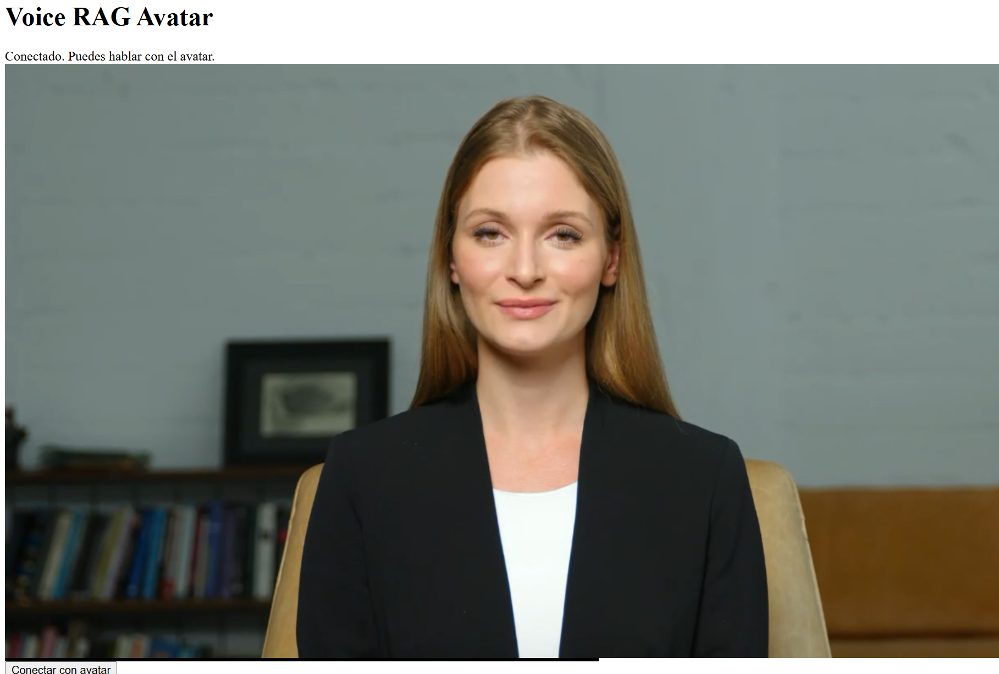

# Voice RAG Avatar

Asistente conversacional con avatar en tiempo real para el sector farmacéutico. Pipeline de voz RAG que responde exclusivamente a partir de documentación clínica propietaria — sin alucinaciones, sin conocimiento general.

## Demo



## Arquitectura

```
Voz del usuario
  → ElevenLabs Conversational Agent  (STT + LLM + TTS)
  → Tool call: retrieve_context       (recuperación RAG)
  → FastAPI backend                   (capa de recuperación)
  → Qdrant                            (documentación clínica indexada)
  → ElevenLabs Agent                  (generación de respuesta)
  → HeyGen LiveAvatar                 (avatar visual en tiempo real)
  → Navegador (LiveKit)               (vídeo + audio WebRTC)
```

La capa RAG está completamente desacoplada de la capa de avatar: Qdrant gestiona siempre la recuperación de conocimiento, ElevenLabs gestiona la voz y el razonamiento, y HeyGen se usa exclusivamente como superficie de salida visual.

## Características

- **Respuestas fundamentadas** — el LLM solo responde a partir de los chunks recuperados; si la respuesta no está en la base de conocimiento, lo indica
- **Voice-first** — conversación completa de voz a voz con latencia percibida mínima
- **Avatar en tiempo real** — avatar con sincronización labial en tiempo real via HeyGen LiveAvatar + LiveKit WebRTC
- **Recuperación MMR** — Maximal Marginal Relevance para reducir redundancia entre chunks
- **Multilingüe** — embeddings con `BAAI/bge-m3` (alto rendimiento multilingüe)
- **Gestión de credenciales** — todos los secretos via `.env`, nunca hardcodeados

## Stack

| Capa | Tecnología |
|---|---|
| Embeddings | `BAAI/bge-m3` via HuggingFace |
| Vector store | Qdrant Cloud |
| Agente conversacional | ElevenLabs Conversational AI |
| Avatar | HeyGen LiveAvatar LITE |
| Transporte en tiempo real | LiveKit (WebRTC) |
| Backend de recuperación | FastAPI + uvicorn |
| Ingesta de documentos | PyMuPDF, LangChain text splitters |

## Estructura del proyecto

```
voice-rag-avatar/
├── notebooks/
│   └── voice-rag-avatar.ipynb   # notebook de integración final
├── ingestion/
│   └── ingest.py                # script genérico PDF → Qdrant
├── docs/
│   ├── architecture.md          # decisiones de arquitectura
│   └── demo.png                 # captura del sistema en funcionamiento
├── .env.example                 # variables de entorno necesarias
├── requirements.txt
└── README.md
```

## Setup

### 1. Clonar e instalar

```bash
git clone https://github.com/TU_USUARIO/voice-rag-avatar.git
cd voice-rag-avatar
pip install -r requirements.txt
```

### 2. Configurar variables de entorno

```bash
cp .env.example .env
# Edita .env con tus propias credenciales
```

Servicios necesarios:
- [Qdrant Cloud](https://cloud.qdrant.io) — tier gratuito disponible
- [ElevenLabs](https://elevenlabs.io) — agente conversacional
- [HeyGen](https://heygen.com) — acceso a LiveAvatar API

### 3. Indexar documentos

```bash
python ingestion/ingest.py --docs-dir ./mis_documentos --collection mi_coleccion
```

Divide los PDFs en chunks, genera embeddings con `BAAI/bge-m3` y los sube a Qdrant.

### 4. Configurar el agente de ElevenLabs

En tu agente de ElevenLabs, añade una herramienta personalizada:

- **Nombre:** `retrieve_context`
- **Método:** `POST`
- **URL:** `https://TU_URL_NGROK/retrieve-context`
- **Parámetro body:** `question` (string)

### 5. Ejecutar el notebook

Abre `notebooks/voice-rag-avatar.ipynb` y ejecuta todas las celdas. Se abrirá una ventana del navegador con el avatar listo para conversar.

## Cómo funciona

### Flujo de recuperación

Cuando el usuario hace una pregunta, el agente de ElevenLabs activa la herramienta `retrieve_context`. Esta llama al backend FastAPI, que consulta Qdrant usando búsqueda MMR (k=6, fetch_k=20) para recuperar los chunks más relevantes y diversos. Los chunks se formatean con metadatos de fuente y se devuelven al agente como contexto para la generación.

### Integración del avatar

HeyGen LiveAvatar se conecta al agente de ElevenLabs via `elevenlabs_agent_config` — integración nativa que elimina la necesidad de piping manual de audio. La sesión corre sobre LiveKit WebRTC y se renderiza en un viewer HTML local.

### Base de conocimiento

La base de conocimiento usada en este proyecto contiene documentación clínica confidencial y no está incluida en el repositorio. El script de ingesta (`ingest.py`) es completamente genérico y funciona con cualquier colección de documentos PDF.

## Evolución del proyecto

Este proyecto pasó por 16 iteraciones. Decisiones arquitectónicas clave:

- **v1–v5:** Pydantic AI + Gemini como LLM, pyttsx3 para TTS local
- **v6–v10:** Backend FastAPI + ngrok para exponer la recuperación a ElevenLabs
- **v11–v13:** ElevenLabs Conversational Agent reemplaza a Pydantic AI; WebSocket manual + resampleo de audio PCM (16kHz→24kHz) para HeyGen
- **v14–v16:** Integración nativa `elevenlabs_agent_config` elimina el pipeline de audio manual

## Licencia

MIT
